# How to set up a development VM on windows

+ [Prerequisites](#prerequisites)
+ [Steps](#steps)
  + [Step 1. Install virtual box](#step-1-install-virtual-box)
  + [Step 2. Download a linux ISO](#step-2-download-a-linux-iso)
  + [Step 3. Create a VM for development](#step-3-create-a-vm-for-development)
  + [Step 4. Configure SSH access](#step-4-configure-ssh-access)
  + [Step 5. Setup your VM for development](#step-5-setup-your-vm-for-development)
+ [Bonus tweaks](#bonus-tweaks)
  + [Configure SSH Remote projects](#configure-ssh-remote-projects)
  + [Declare port forwarding for your applications](#declare-port-forwarding-for-your-applications)

## Prerequisites

- Windows 10, with OpenSSH installed
  - OpenSSH should come installed in later builds
- WSL/Hyper V disabled.
  - Virtual Box should ask you to do this, and tell you how to, if necessary.

## Steps

### Step 1. Install virtual box

Install from https://www.virtualbox.org/wiki/Downloads

1. Select the **Windows Host** option.
2. Install virtual box, following the prompts.

### Step 2. Download a linux ISO

Its up to you what linux distro you'd like to use. Here are a few options.

- Ubuntu: https://ubuntu.com/download
  - You're welcome to use the **server** or **desktop** version.
  - **Server** is recommended as it will consume less memory, but, if you're got memory to spare feel free to try a desktop ISO to try out the experience, especially if you're not comfortable with CLI's
- Manjaro: https://manjaro.org/download/
  - An Arch Linux based distro with a desktop environment

### Step 3. Create a VM for development

1. Open Virtual Box and click "**New**":
> 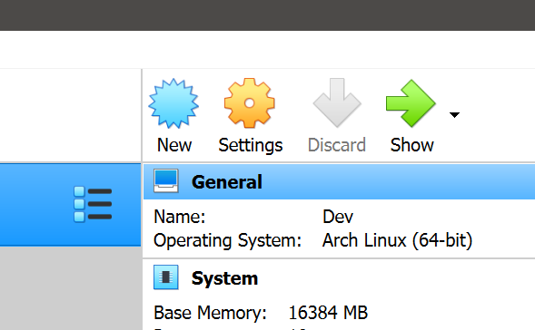
2. Select the "**Expert Mode**" down the bottom, to see this view:
> 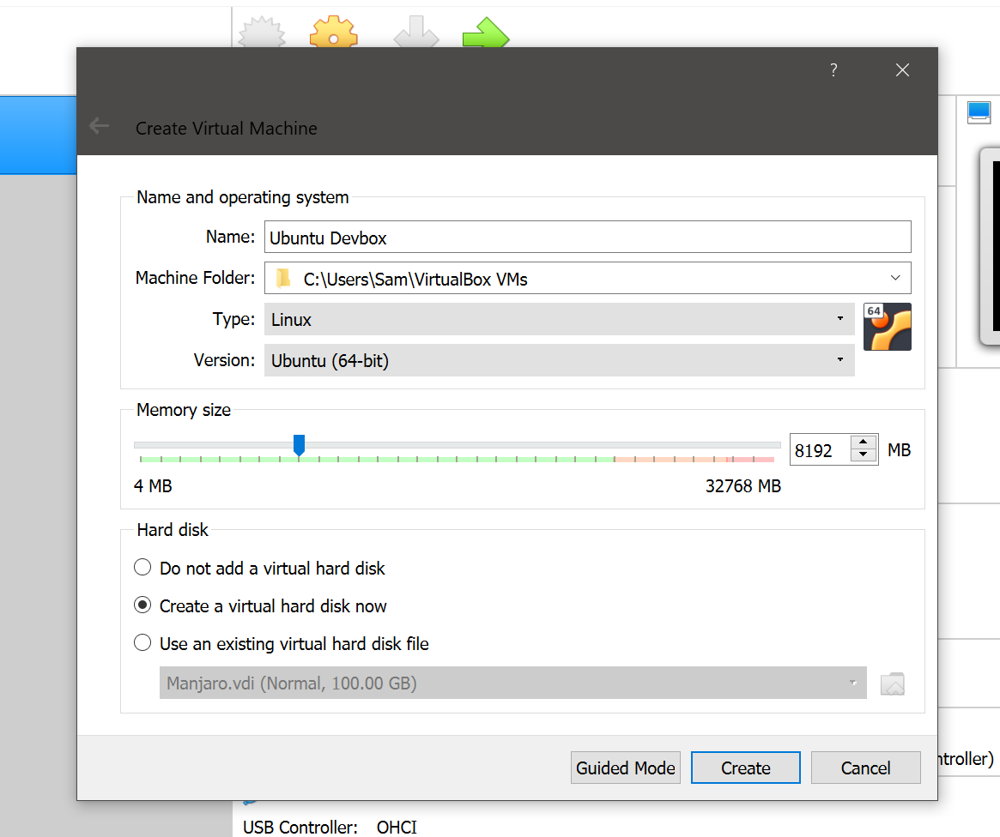
3. Make sure to give it enough RAM, usually **8-16gb** is enough
4. Ensure **Create a virtual hard disk now** is selected, then click **Create**
5. Create your virtual disk as configured:
> 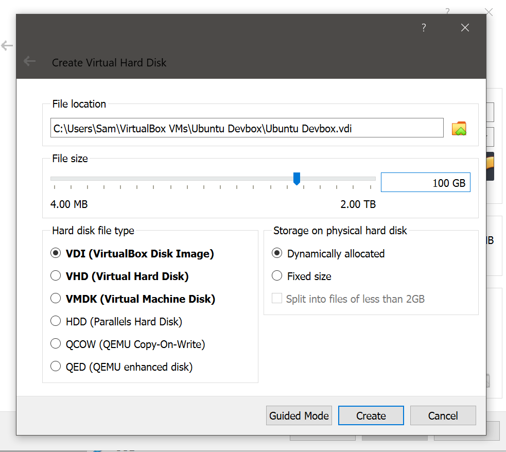
6. You'll want to select **Dynamically Allocated** and set your size to about **100gb**. You can increase the size, any time, but be aware you cannot shrink it. Click **Create**.
7. Now, configure your newly created VM. Click **Settings**:
> 
8. Navigate to **Storage** then click **Empty** under **Controller: IDE**. Check the **Live CD/DVD** box, then click the **blue disk icon**. Select your downloaded .iso.
> 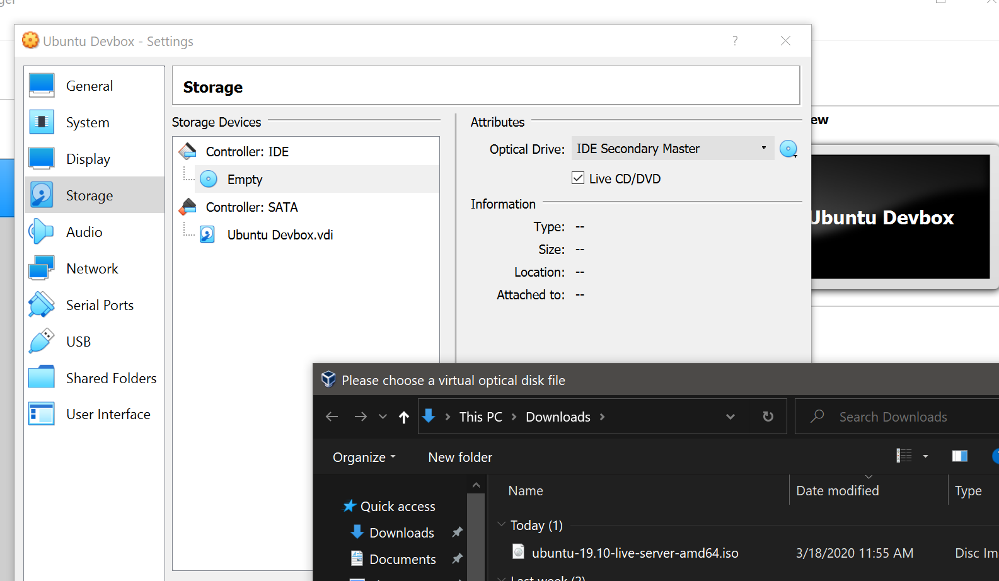
9. Configure the **System** section to look similar to the below image. Check the **Extended Features** checkboxes, and ensure you give the VM enough CPU cores (usually untill the red part of the slider).
> 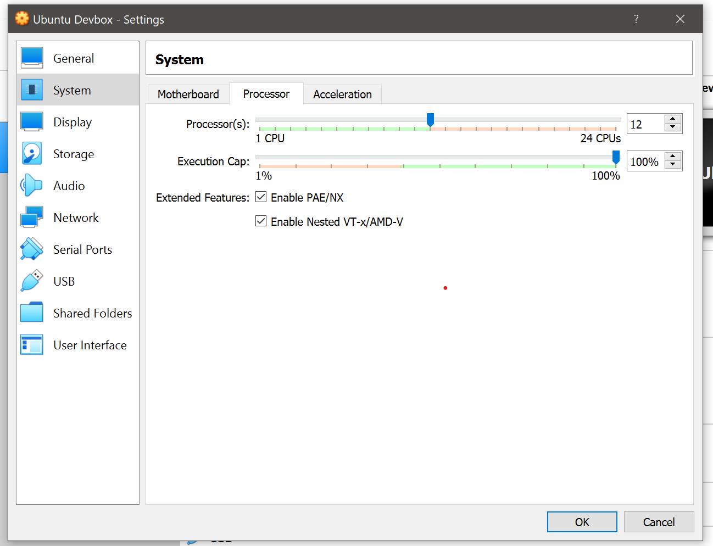
10. Start the VM
> 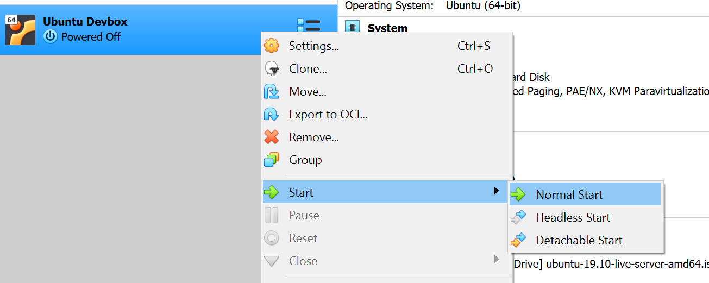
11. Your VM should start booting. I chose Ubuntu Server.
> 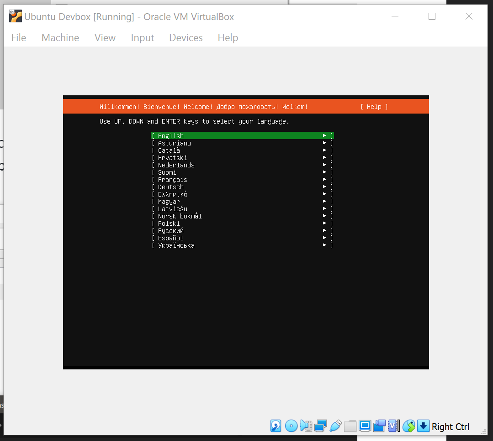
12. Configure your new Linux system. It should guide you through the process depending on which distro you chose. Typically you can use the default options (spam the enter key!). For this guide, we will name our linux user `dev`.
> 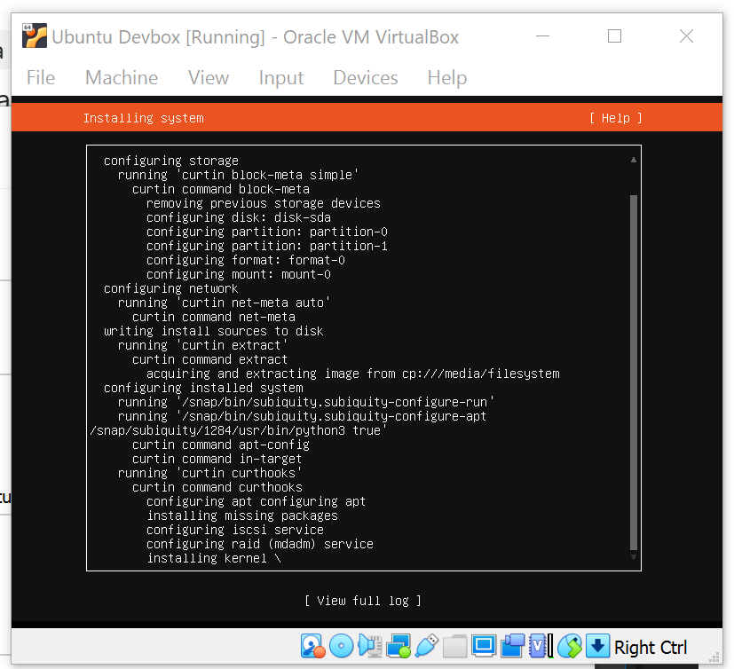
13. When your system is done with the initial setup phase, its time to configure your environment for development.
14. Dont forget to remove the Live CD or it may not boot the installed system, then restart the VM:
> 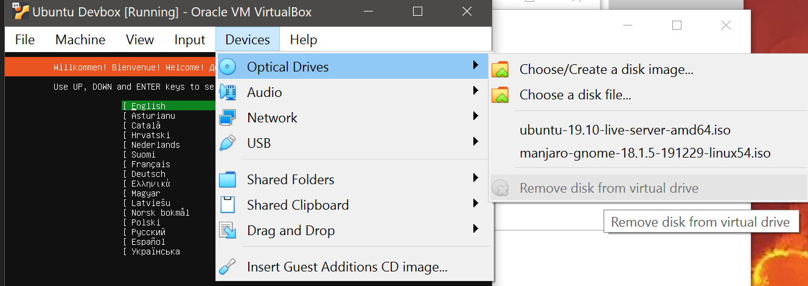
15. You must now port forward your VM to a new port that your Windows host machine can use to access it. Visit the network section of your VM (VM can be running), and configure it like so:
> 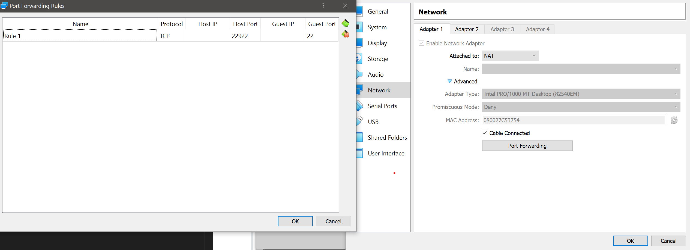
16. We are forwarding port `22` from the guest to `22922` on the host. When SSH'ing to your VM, you will use port `22922`

  
### Step 4. Configure SSH access

1. Open VSCode and install the `SSH: Remote` extension
   - https://marketplace.visualstudio.com/items?itemName=ms-vscode-remote.remote-ssh
2. Press `F1` to open the command palette, then find the command **Open Configuration File**
> 
3. Select `~/.ssh/config` from the options
> 
5. Add an entry so your `~/.ssh/config` file looks like:
    ```
    Host devbox
      HostName localhost
      User dev
      Port 22922
      IdentityFile ~/.ssh/id_rsa
      PubkeyAuthentication yes
    ```
6. Once configured, navigate to the SSH Remote explorer in VSCode and try opening a connection to your newly configured SSH target by clicking the folder icon next to the target:
> 
>  Take note, `devbox` has a bunch of targets. Whenever you open a new folder, it will automatically appear in the list for easy access later
7. It will ask for a password. If all is well, you should see a terminal open and you're ready to use your VM
8. You can also now use Powershell like so to SSH:
    ```
    ssh devbox
    ```
9. Now, we will make the password prompt go away. Create an SSH key pair on Windows:
   1. Open Powershell and `cd ~/`
   2. Make an ssh folder (if it doesnt exist yet) `mkdir .ssh`
> 
10. Run `ssh-keygen` and hit `Enter` until your key pairs are created (default values selected)
11. You will now have an `id_rsa` and `id_rsa.pub` inside `~/.ssh`
12. Inside your VM create a `~/.ssh/authorized_keys` file and paste the contents of the `id_rsa.pub`. You can do this via SSH Remote or try a regular SSH session. You likely won't be able to copy paste content in the Virtual Box guest GUI because it requires "Guest additions" to be installed first.
13. Once this is done, you will no longer be prompted for a password upon connecting

### Step 5. Setup your VM for development

Depending on your distro of choice, you'll have to install development related dependencies, but you should be able to discover what they are if you get an error during normal use.

1. Install **Node Version Manager (NVM)**
    - https://github.com/nvm-sh/nvm
    - Start by installing a version of node: `nvm install 12`
    - This will now be your default, and your system now has `node` and `npm`
2. Install `yarn`:
      - `npm i -g yarn`
      - or on your OS: `sudo apt-get install yarn`

3. ...
4. Make profit

## Bonus tweaks

### Configure SSH Remote projects

As depicted in this image:

> 

To add a new project target; connect to the top level target you have, it should put you in your home folder, then try running this in the VSCode terminal:

```
  mkdir foo
  code foo
```
> Note, if you may be using `code-insiders` instead of `code`

You will now have `~/foo` as a target in the SSH Targets explorer sidebar

### Declare port forwarding for your applications

In your ssh config you can tell VSCode's SSH Remote to automatically forward ports from your VM to your host.

Normally ports are forwarded only when they are accessed such as by clicking a link in the terminal of a newly running server.

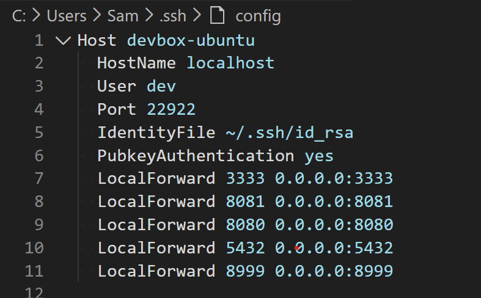