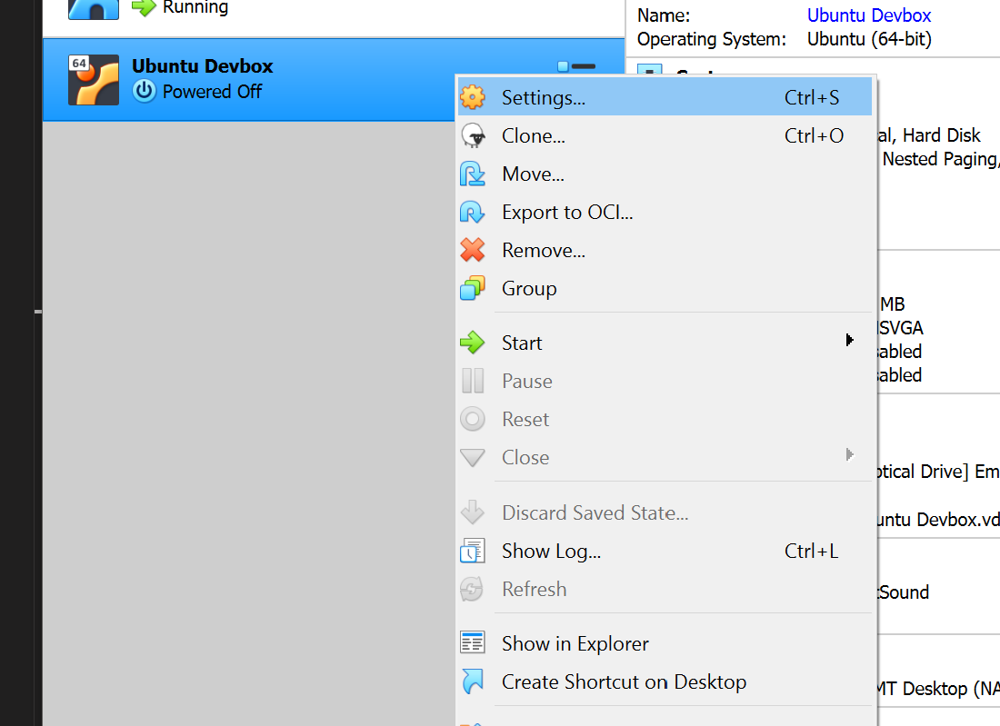

# How to set up a development VM on windows

+ [Outline](#outline)
+ [Prerequisites](#prerequisites)
+ [Steps](#steps)
  + [Step 1. Install virtual box](#step-1-install-virtual-box)
  + [Step 2. Download a linux ISO](#step-2-download-a-linux-iso)
  + [Step 3. Create a VM for development](#step-3-create-a-vm-for-development)
  + [Step X. Configure VSCode for remote development](#step-x-configure-vscode-for-remote-development)

## Outline

- Use `virtual-box` to run a linux virtual machine for development
- Configure VSCode to connect to it via the `SSH: Remote` extension

## Prerequisites

- Windows 10
- WSL/Hyper V disabled.
  - Virtual Box should ask you to do this, and tell you how to, if necessary.

## Steps

### Step 1. Install virtual box

Install from https://www.virtualbox.org/wiki/Downloads

1. Select the **Windows Host** option.
   
2. Install virtual box, following the prompts.

### Step 2. Download a linux ISO

Its up to you what linux distro you'd like to use. Here are a few options.

- Ubuntu: https://ubuntu.com/download
  - You're welcome to use the **server** or **desktop** version.
  - **Server** is recommended if you're familiar with linux and want a more lightweight setup (less memory usage)
- Manjaro: https://manjaro.org/download/
  - An Arch Linux based distro with a desktop environment

### Step 3. Create a VM for development

1. Open Virtual Box and click "**New**":
> 
2. Select the "**Expert Mode**" down the bottom, to see this view:
> 
3. Make sure to give it enough RAM, usually **8-16gb** is enough
4. Ensure "**Create a virtual hard disk now** is selected, then click **Create**
5. Create your virtual disk as configured:
> 
6. You'll want to select **Dynamically Allocated** and set your size to about **100gb**. You can increase the size any time later. Click **Create**.
7. Now, configure your newly created VM. Click **Settings** as below:
> 
8. Navigate to **Storage** then click **Empty** under **Controller: IDE**. Check the **Live CD/DVD** box, then click the **blue disk icon**. Select your downloaded .iso.
> 
9. Configure the **System** section to look similar to the below image. Check the **Extended Features** checkboxes, and ensure you give the VM enough CPU cores (usually untill the red part of the slider).
> 

### Step X. Configure VSCode for remote development

1. Install the `SSH: Remote` extensions